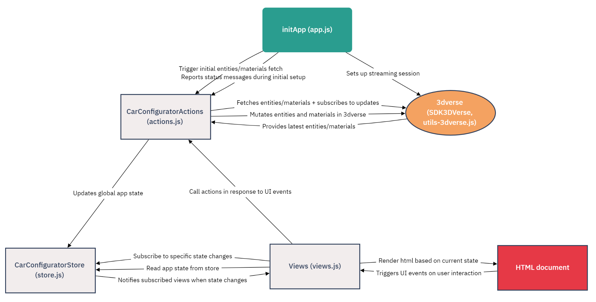

# car-configurator
A sample app built using the 3dverse Livelink SDK to manipulate a scene in 3dverse.

This app is written with plain HTML, CSS and JavaScript, plus a few Handlebars templates for data-driven HTML elements. The only external libraries it uses are Handlebars and the 3dverse Livelink SDK. But of course you can use whatever UI framework you prefer (React, Vue, Svelte, Angular, etc), to build your own 3dverse application.

Here is the basic flow of this app:

(This chart was created with [flowchart.fun](https://flowchart.fun/))

TODO
## 1. figure out what to do with asset editor api
## 2. Fix client avatars
## 3. Fix list of cars
4. use different version of dodge from houssem
5. Implement transient session
6. Make sure to consolidate git repo / single commit before release
7. Fix scene state before switching to all transient changes
8. Document app design principles for 3dverse app
9. Come up with short challenges we can give new users to modify the behavior of the app (ideally done in a way that users don't need to access the editor right away)
